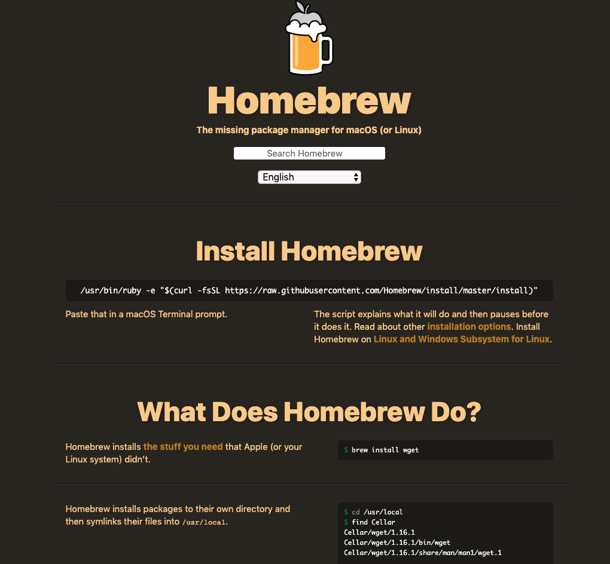
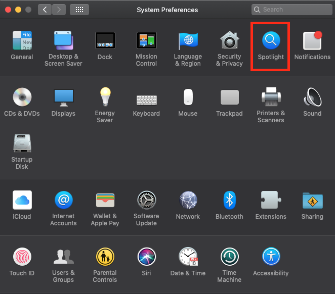
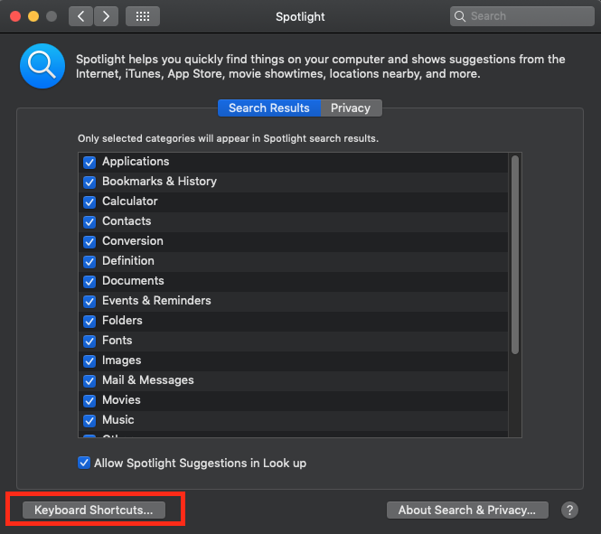
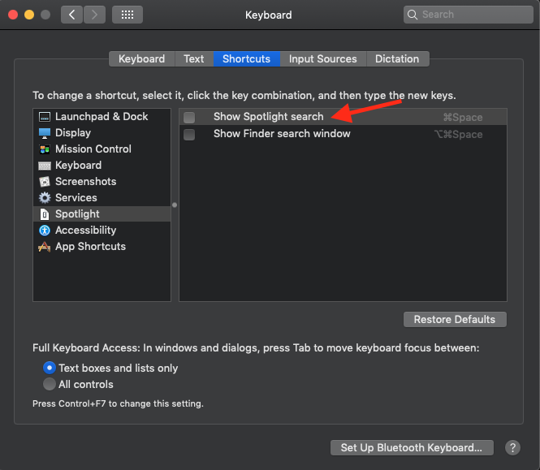
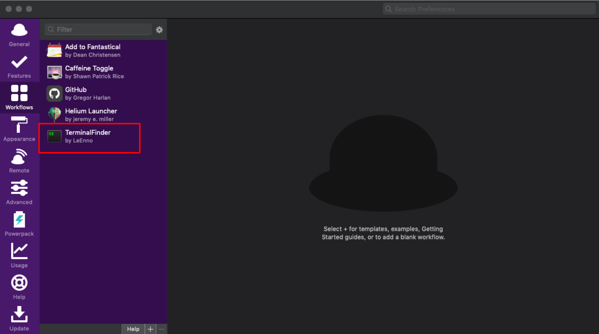
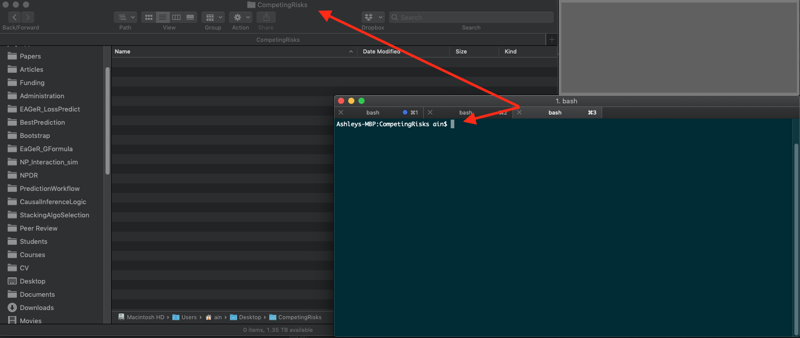

<br>
<br>
<br>

# Setting Up Your Mac for Scientific Computing

## Introduction

This document is a guide to setting up a new Apple computer to do data science in the causal research group. These steps should be followed in order.

#### HomeBrew

The first software program to install is HomeBrew. This is an application manager for the MacOS system, and will allow you install and update several programs easily from the command line. Go to the Homebrew [website](https://brew.sh/):

```{r, out.width = "500px",echo=F, fig.align="center"}

```

Copy the most recent link, and paste it in the Terminal (see below) to install brew. Currently, the command to paste is:

```{}
/usr/bin/ruby -e "$(curl -fsSL https://raw.githubusercontent.com/Homebrew/install/master/install)"
```

But this may change with time. With brew installed, you can now easily install a host of other programs.

If you've never used the Terminal before, it's easy. Navigate to the "Utilities" sub-folder in the Applications folder. There you will find a program called ``Terminal.app'' 

```{r, out.width = "500px",echo=F, fig.align="center"}
knitr::include_graphics("./figures/Terminal1.png")
```

Open it. This is the native command line interface for MacOS. Paste the above link to install HomeBrew.

To ensure HomeBrew has successfully been installed, you can type the following command in Terminal:
```{}
brew -v
```

Check to see that the above returns the latest version number. Additionally, you can type the following in Terminal to see if there were any issues with the install.

```{}
brew doctor
```

#### iTerm2

Once HomeBrew is installed, the next step is to install a more advanced command line interface: iTerm2. This can be done easily by typing the following within terminal:

```{}
brew cask install iterm2
```

You can now open the iTerm2 app in the applications folder. To make the iTerm2 command line interface easier to use, there are a few steps that should be implemented. First, we'll change the "key mappings." Open up the preferences pane in iTerm2. Under the "Profiles" pane in the "keys" sub-pane, add the following key mappings (by clicking on the "+" icon): 

  - Delete all text to left of cursor: \cmd Delete, Send Hex Code, 0x15 
  - Delete one word to left of cursor: \Alt Delete, Send Hex Code, 0x01b 0x08 
  - Move cursor to beginning of line: \cmd \arrowkey{<}, Send Hex Code, 0x01 
  - Move cursor to end of line: \cmd \arrowkey{>}, Send Hex Code, 0x05 
  - Move cursor one word to left: \Alt \arrowkey{<}, Send Hex Code, 0x1b 0x62 
  - Move cursor one word to right: \Alt \arrowkey{>}, Send Hex Code, 0x1b 0x66 

#### Command Line Tools

To do data science on an Apple computer, you'll need to install Apple's command line tools. This is easy in iTerm:

```{}
xcode-select --install
```

#### Alfred

An important element in working productively on a computer is finding tricks to optimize workflow. Alfred ([https://www.alfredapp.com/](https://www.alfredapp.com/)) is an app that allows you to interact with your computer in efficient and effective ways.

Alfred can be installed with Homebrew in iTerm2:

```{}
brew install --cask alfred
```

Once installed, you should set up a shortcut key to open Alfred with your keyboard. I like to use `Command + Space`, but this key combination is already in use by the MacOS Spotlight app. To make it work, open up system preferences and navigate to the Spotlight pane:

```{r, out.width = "500px",echo=F, fig.align="center"}

```

Click on "keyboard shortcuts":

```{r, out.width = "500px",echo=F, fig.align="center"}

```

And disable the "Show Spotlight search" option:

```{r, out.width = "500px",echo=F, fig.align="center"}

```

Once these steps are completed, open Alfred preferences, place your cursor in the "Alfred Hotkey" box, and press the `Command + Space` keys. 

```{r, out.width = "500px",echo=F, fig.align="center"}
knitr::include_graphics("./figures/Alfred1.png")
```

You should now be able to open up the Alfred app with `Command + Space`.

As a member of the ESCI group, you have access to the Alfred Power Pack. Please ask Ashley for the details. With the Power Pack installed, you will be able to install ``workflows,'' which can make using your computer a lot easier. The first workflow to install is TerminalFinder:


[http://www.packal.org/workflow/terminalfinder](http://www.packal.org/workflow/terminalfinder)

Once you download the TerminalFinder app, open up Alfred preferences, and drag and drop it on the ``Workflows'' panel:  

```{r, out.width = "500px",echo=F, fig.align="center"}

```

With the TerminalFinder workflow, you should be able to navigate from a folder on your computer to the command line directory for that folder in iTerm2. For example, suppose you want to start writing a paper on competing risks. You create a folder on your computer called ``CompetingRisks'':
```{r, out.width = "500px",echo=F, fig.align="center"}
knitr::include_graphics("./figures/cr_folder.png")
```

If you navigate to that folder, it should be empty. From this folder, you should be able to press `Command + Space` and (with the TerminalFinder workflow installed) then type ``fi'' (which stands for Finder $\rightarrow$ iTerm) and press enter. This should take to you the iTerm app, with the command line directed to the CompetingRisks folder:
```{r, out.width = "500px",echo=F, fig.align="center"}

```

You can now create several files needed to start a project on competing risks directly from the command line (this process will be covered in a ``Project Workflow'' document to be created)).

#### git

Git is a version control software program that allows us to systematically track changes in code documents. There is already a version of git installed on all Apple computers, but it is an older version. To install the newer version, open up iTerm2. On the command line, simply type:

```{}
brew install git	
```

Be sure to restart your command line interface program (e.g., iTerm.app) and then run:

```{}
git --version
```

To verify that you are no longer running Apple's git version, but the most updated version instead.

#### LaTeX

Once brew is installed, you can install LaTeX via brew by typing these into the command line:
```{}
brew cask install mactex
```

MacTex is a very large program, and this may take some time to install. You may opt to install other versions instead, such as BasicTex. However, I've found that I often just end up installing MacTex because it includes all the dependencies one might need to run Tex through various programs (e.g., RStudio). Some details can be found [here](https://tex.stackexchange.com/questions/974/why-is-the-mactex-distribution-so-large-is-there-anything-smaller-for-os-x).

#### Texpad

With LaTeX installed, you may wish to install an app that allows you to write .tex code and simultaneously see what changes occur to the rendered .pdf file. Texpad is a great app for this. 
```{}
brew cask install texpad
```

Once installed, you may have to install some dependencies, but in my experience Texpad does a good job at doing this for you.

#### R & RStudio

There are a number of different ways to install `R` and `RStudio`, even in Homebrew. Here is the simplest way that should (not tested!) also install fast linear algebra routines:
```{}
brew install r
brew cask install rstudio
```

TODO:

  - A windows version?
	- Need a section on installing compilers for r to run, e.g., gcc, others.
	- Sublime Text
	- Docker
	- GitLab?