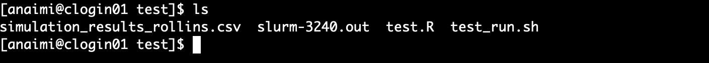

<br>
<br>
<br>

# Accessing and Using Rollins HPC: A Basic Introduction


#### Introduction: The Center for Resource Computing

The Rollins School of Public Health houses a computing cluster, and if you are joining our research team, you will most likely have to use it at some point in your analyses. This document is meant to help you familiarize yourself with the basics behind using the Rollins computing cluster. 

To gain access to the cluster you must first open an account, and acquire access to the Emory-VPN HIPAA core, which can be done by emailing your advisor to request access (they will need an account).

\noindent Once your account is created, and clearance and VPN access is obtained, you may access the computing cluster. 

#### Logging into and Exploring the Cluster

The cluster is a unix server that can be accessed from the command line on your computer (e.g., Terminal on macOS). First, ensure you are connected to the VPN. Next, open up the command line interface. This includes Terminal on a Mac (or a Terminal emulator, such as Iterm2), Terminal on a Linux machine, or Powershell on a Windows Machine. Once open, you are interacting with the command line interface (CLI), or the prompt from which you can access the cluster. To access the cluster, you must login via SSH which can be done with the following command:

```{}
ssh [username]@clogin01.sph.emory.edu
```

where `[username]` should be replaced with your user name. If you enter the above on the command line (and are connected to the VPN), you should be prompted to enter a password. If it's your first time logging on, you will need to follow the instructions in the above user's guide. Otherwise, use the password you set at your first login and proceed. 

If you're unfamiliar with the unix terminal, you may find that when you try to type in your password, it doesn't work (i.e., nothing visual gets typed into the console). However, you should know that unix/linux systems do not provide any indication that there is a password being entered (no dots or asterisks). For some context, see (here)[https://unix.stackexchange.com/questions/268006/why-is-the-password-i-entered-not-visible].

Once you enter the password, this should connect you to the cluster. You will know that you have successfully connected when you see the welcome page on your command line interface:

```{r, out.width = "500px",echo=F, fig.align="center"}
knitr::include_graphics("./figures/ss1.png")
```

At this point, you will need to use some basic commands to interact with the Unix system. There are a lot of resources available on this topic. The best I've found (so far) is the free book by Sean Kross: 

https://seankross.com/the-unix-workbench/


The more familiar you are with Unix commands, the easier time you will have using the cluster. Here, I'm going to show you some basic ways to interact with the cluster, and how to submit a job. 

First we'll get a sense of where we are on the cluster. If you use the `ls` command, you will get a list of what's in your current directory:

```{r, out.width = "500px",echo=F, fig.align="center"}
knitr::include_graphics("./figures/ss2.png")
```

This tells me that I have two folders in my login (or home) directory R and test. 

We can also use the `pwd` command to figure out where we are in the tree structure of the cluster:

```{r, out.width = "500px",echo=F, fig.align="center"}
knitr::include_graphics("./figures/ss3.png")
```

\noindent which tells us that my folder (`anaimi`) is located in a home folder (`home`). We can move around from one directory to another and explore using the `cd` command and then the `ls` command. For example, to see what's in the `test` folder, I can use the `cd` command, which stands for "change directory":

```{}
cd test
```

When we do this, and then `ls` the files in the directory we moved to, we get this:

```{r, out.width = "1000px",echo=F, fig.align="center"}
knitr::include_graphics("./figures/ss4.png")
```

\noindent This tells us that in our test folder (`~/anaimi/test`), there are six files. This folder contains the examples we will be using to get you familiar with the cluster in this group. The files containing "_pitt" in their name were similarly used for similar purposes when I taught at the University of Pittsburgh. 

Finally, for the sections that follow, it may be good to know that I typically open two command line interfaces: one that is working in the local directory that I have all of my relevant project files in, and the other that is working on the cluster. On my local computer, this is what my screen looks like:

```{r, out.width = "1000px",echo=F, fig.align="center"}
knitr::include_graphics("./figures/ss5.png")
```

#### Running a Job


Running a job on the cluster can be broken down into four basic steps\footnote{Is there a way to ensure dependencies are installed and working for all users w/o them having to install manually?}:

1. Creating and testing the programs needed to complete the job.
2. Moving all data, files, and folders from your local computer to the cluster.
3. Testing and running the job on the cluster.
4. Moving all results and data from cluster back to local computer.

We will explore each of these steps using a very simple example. 

#### Step 1: Local Tasks

First you need the files and programs that make up your job. To keep things simple, suppose we were interested in generating a csv file with 10 columns and 500 rows, with all values drawn from a standard normal distribution. We can do this easily with the `MASS` package:

```{r, eval=F,echo=T}
install.packages("MASS",repos='http://lib.stat.cmu.edu/R/CRAN')
library(MASS)
covariate_num <- 10
N <- 500
Sigma <- diag(1,covariate_num,covariate_num)
set.seed(123)
res <- mvrnorm(n = N, rep(0, covariate_num), Sigma)
write.csv(res,"./simulation_results.csv",row.names=F)
```

\noindent You should copy and paste this code into an R script, and save it as `test.R`. Make sure to test that it runs on your computer. Once this program successfully returns what you need on your local computer, the next step is to move it to the cluster.

#### Step 2: Moving files to the cluster

There are a number of different ways one can move files and folders from a local computer to the cluster. If you are uncomfortable with the command line, you should look into the following file transfer protocol (FTP) applications. Two that I liked and used in the past include FileZilla:

https://sourceforge.net/projects/filezilla/

and transmit:

https://panic.com/transmit/

These applications allow you to easily drag-and-drop files from your local computer to the cluster, but you must set them up appropriately. Here, we will look at using secure copy, or `scp`. You will first need to open up the command line with the directory pointing to the location where your `test.R` program is. You can `cd` directly into the folder with this program. On my computer, this program is located in the `~/ClusterFolder/RSPHC/test/` folder. To `cd` into this folder and copy the test.R file to the Rollins cluster, I can use the following commands (note that you must still be logged on to the VPN):

```{}
cd ~/ClusterFolder/RSPHC/test/
scp test.R anaimi@clogin01.sph.emory.edu:~/test/
```

The above code says to secure copy the `test.R` file to the `test` subfolder in the home directory `~/test` of the `anaimi@clogin01.sph.emory.edu` account. Once this code is run, you should be prompted to enter your password. After you enter your password, you will receive confirmation that the file was successfully copied:

```{r, out.width = "500px",echo=F, fig.align="center"}
knitr::include_graphics("./figures/ss6.png")
```
 
And we can now see this file on the command line as well:

```{r, out.width = "500px",echo=F, fig.align="center"}
knitr::include_graphics("./figures/ss7.png")
```

#### Step 3: Testing and running the job on the cluster

Now that the `test.R` file is on the cluster, we can begin the process of testing and running it. There are many ways to test a program on the cluster. Just keep in mind that when testing, you should not use a program that will run for days, or use up all the computing resources with heavy parallel runs. Instead, run only what you need to confirm that you are getting the expected output, and nothing more.

First, to keep things organized, we'll move our `test.R` from the home folder to a sub-folder in home. To do this, enter the following commands on the cluster's command line:

```{}
mkdir test
mv test.R test
cd test
ls
```

The above code makes a folder (directory) called "test" (first line), then moves the `test.R` file into the "test" folder (second line), and then changes the CLI directory from "home" to "test" (third line). The `ls` in the last line of the code above just confirms that the `test.R` file is actually in the "test" folder.

Next we can begin testing our program in the cluster environment. One simple way to do this is to open R directly on the command line. To do this, you need two simple steps. First, you have to ensure that R is loaded in the cluster environment you are in. To do this, use the `module load` command in the cluster's command line:

```{}
module load R
```

Then, all you need to do is type `R` and press "enter". This should lead to the following display:

```{r, out.width = "500px",echo=F, fig.align="center"}
knitr::include_graphics("./figures/ss8.png")
```

You can now copy and paste your code (from your local computer) directly into the `R` console and run it as you would on your local computer (note that to do this, you don't actually need to scp the file to the cluster, but it's good to know how to use `scp`). This is one way to evaluate whether any problems will occur when running your job on the cluster. 

Another way to test jobs is to actually run them through the batching system that all users are required to use when running jobs. The process occurs as follows:

1. Write a shell script with the necessary arguments and options to run your job
2. Run the shell script with `sbatch`

Note there are many more details (plus some examples) on this how to use `sbatch` (or more generally, SLURM commands, of which `sbatch` is an example) available available in the User's Guide.

To run a job with the batching, we need to first write a shell script with the arguments and options needed for our job. We can either write a shell script locally (using, e.g., any text editor on your local computer) and use `scp` to get it on the cluster. Alternatively, you can open an editor directly on the cluster (e.g., `vim`) and write it there (click [here](https://www.openvim.com/), [here](https://linuxconfig.org/vim-tutorial), or [here](https://www.linux.com/training-tutorials/vim-101-beginners-guide-vim/) for some tutorials on `vim`). For our `test.R` job, here is an example shell script, which we'll call `test_run.sh`:

```{}
#!/usr/bin/env bash
#SBATCH --mail-type=ALL
#SBATCH --mail-user=ashley.naimi@emory.edu
#SBATCH --nodes=1
#SBATCH --ntasks-per-node=24
#SBATCH --time=00:10:00
#SBATCH --job-name=test_run
#SBATCH --mem=120g
#SBATCH --partition=short-cpu

module purge
module load R

Rscript test.R
```

This shell script consists of three components: SBATCH options, module loading, and script running. 

The SBATCH options determine the characteristics of your job. In the above script, the first two arguments tell the cluster to send me an email with all information about my job (start, stop, error, cancel, etc). The nodes option sets the number of nodes you will be using on the cluster. Except in special circumstances, for the work done in our group *this should almost always be one* (even when parallel processing). The number of tasks per node option sets the number of cores that will be used on each node. Typically, you would set this to the maximum, which on the Rollins cluster will be 24 or 32.

The time argument is an important choice. Short time-jobs tend to get bumped up in the queue (and thus there's a shorter wait time for your job to get started). However, too short, and your job won't have time to complete the job. This is typically one of the parameters I try to estimate using trial runs, to project how long a full run will take. For our `test.R` program, I selected 10 minutes because that is plenty of time for this program to run to completion, and such a short time wall will receive almost immediate priority.

Choosing the right memory threshold is also important. Too little, and your job will stop and return an error. But there is an upper limit to what the cluster can handle. Typically, however, I have found that the cluster memory options are more than available to handle my jobs. If your particular job is running into problems with memory, the Rollins cluster has large memory nodes with up to 1.5TB of RAM. For details on how to access these large memory nodes, please refer to the User's Guide.

Finally, the partition option is important to select appropriately. There are five partitions on the Rollins cluster, each allocated to accommodate programs with a certain run time. Details are on page 6 of the User's Guide.

The next section in the shell script tells the cluster which modules you need to run your job. It's important to start this section with `module purge`, which clears up the environment, thus avoiding potential conflict between modules. 

Finally, you have to load R using `module load r`. Note that we can also specify options here, which I sometimes do. To see which modules are available to use, enter:

```{}
module avail
```

Finally, the command which runs the R program for our job is `Rscript test.R`

To run the shell script shown above (named `test_run.sh`), you need to use the `sbatch` command:

```{}
sbatch test_run.sh
```

After you run this command on the cluster, you should get a confirmation similar to the following:

```{r, out.width = "500px",echo=F, fig.align="center"}
knitr::include_graphics("./figures/ss9.png")
```

In this case, the job ID is 3240 You can check on the status of all the jobs running on your account by typing: `squeue -u $(whoami)`, which should provide you information on the status of job 3240 (note that you will likely not see anything, because the job runs so fast!).

If you selected the `mail-type=ALL` option, you should also receive an email confirming that the job started (this might not occur immediately because of your place in the queue). Similarly, you should receive an email when the job ends as well, which will include information on whether or not it ended successfully (ExitCode=0), or with an error (ExitCode=1, 2, or other number).

Once the job finishes, you should see the output from the `test.R` file in the folder where the job was run:

```{r, out.width = "500px",echo=F, fig.align="center"}

```

In the above figure, we see that we have the output from our `test.R` file, (`simulation_results_rollins.csv`), as well as a log file that capture any information relevant to our job. We have now completed the task of running our job.

#### Step 4: Moving all results and data from cluster back to local computer.

The last step is to move all the relevant files from the cluster back to your local computer. Again, this can be done with any FTP application, or the `scp` command. To do this using `scp`, you must have your command line pointed to a folder on your local computer. In my case, I want to move the files on the cluster back to the folder on my laptop. From a directory on your local computer, use the following on the command line to copy files and data from the cluster to your local computer folder:

```{}
scp anaimi@clogin01.sph.emory.edu:~/test/simulation_results_rollins.csv .
scp anaimi@clogin01.sph.emory.edu:~/test/slurm-3240.out .
```

Be sure to replace my user name with yours. Once you enter your password for both commands, you will receive notification of the status of the download:

```{r, out.width = "1000px",echo=F, fig.align="center"}
knitr::include_graphics("./figures/ss11.png")
```

You should now have the simulation results on your local computer. 

Finally, note that important files and sensitive information should not be stored on the cluster long term. Thus, be sure you have everything you need on your local computer, and clean up the folder space on the cluster. 

To verify that you were able to successfully implement this exercise on your own, run the test.R program on your computer and compare the `.csv` file you obtain to the one you obtain from the run on the cluster. Additionally, as long as you used the seed value of 123 on your local and cluster runs, you can compare your output to the file included [here](./files/simulation_results_rollins.csv). The three should be identical. 


